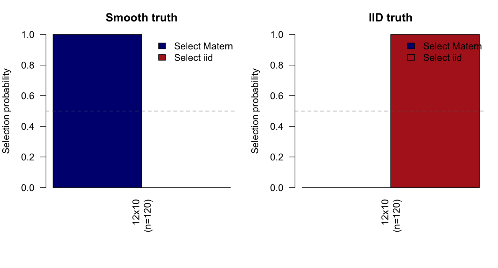
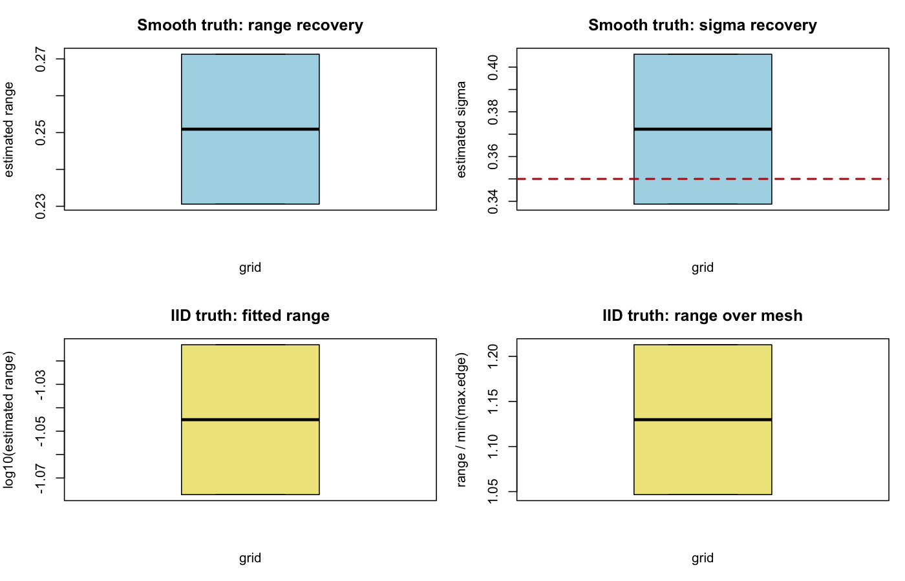

# 2D Matern vs IID Comparison

## Configuration

- reps per cell: 2
- true Matern range: 0.22
- true Matern sigma: 0.35
- true intercept: 0.2
- iid tau0: 0.35
- noise sd: 0.15
- max.edge: 0.08, 0.12
- use pc prior: TRUE
- pc.penalty: range=(0.22, 0.1), sigma=(0.35, 0.5)

## Selection Summary

setting | grid_label | n | n_valid | p_matern | p_iid | mean_delta | median_delta
--- | --- | --- | --- | --- | --- | --- | ---
iid_truth | 12x10 | 120.0000 | 2.0000 | 0.0000 | 1.0000 | -8.7759 | -8.7759
smooth_truth | 12x10 | 120.0000 | 2.0000 | 1.0000 | 0.0000 | 10.3155 | 10.3155

## Smooth Truth

grid_label | n | mean_est_range | median_est_range | mean_est_sigma | median_est_sigma | mean_abs_err_range | mean_abs_err_sigma | mean_surface_corr
--- | --- | --- | --- | --- | --- | --- | --- | ---
12x10 | 120.0000 | 0.2509 | 0.2509 | 0.3722 | 0.3722 | 0.0309 | 0.0335 | 0.9262

## IID Truth

grid_label | n | mean_est_range | q10_est_range | q50_est_range | q90_est_range | q10_range_over_mesh | q50_range_over_mesh | q90_range_over_mesh | mean_surface_corr
--- | --- | --- | --- | --- | --- | --- | --- | --- | ---
12x10 | 120.0000 | 0.0904 | 0.0851 | 0.0904 | 0.0957 | 1.0633 | 1.1298 | 1.1963 | 0.9394

## Figures

