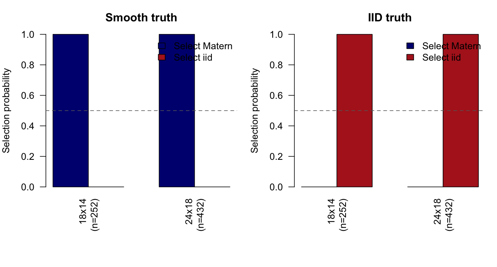
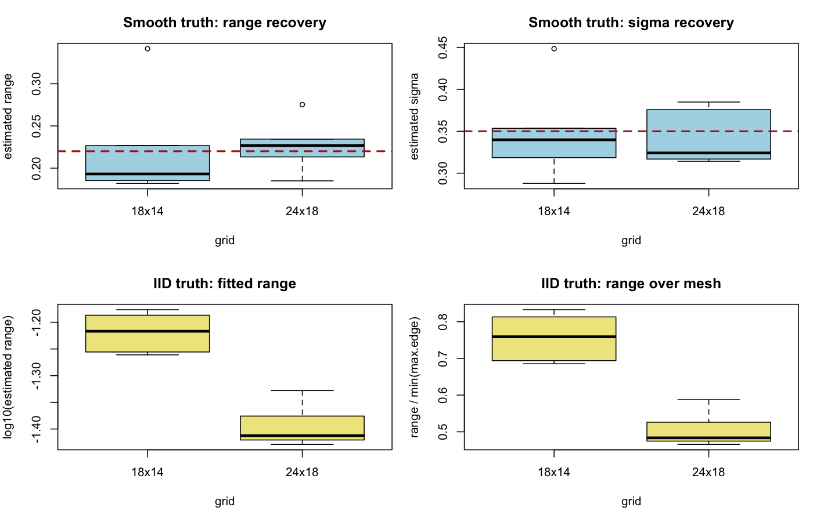

# 2D Matern vs IID Comparison

## Configuration

- reps per cell: 6
- true Matern range: 0.22
- true Matern sigma: 0.35
- true intercept: 0.2
- iid tau0: 0.35
- noise sd: 0.15
- max.edge: 0.08, 0.12
- use pc prior: TRUE
- pc.penalty: range=(0.22, 0.1), sigma=(0.35, 0.5)

## Selection Summary

setting | grid_label | n | n_valid | p_matern | p_iid | mean_delta | median_delta
--- | --- | --- | --- | --- | --- | --- | ---
iid_truth | 18x14 | 252.0000 | 6.0000 | 0.0000 | 1.0000 | -12.3584 | -12.1862
iid_truth | 24x18 | 432.0000 | 6.0000 | 0.0000 | 1.0000 | -17.4102 | -18.1526
smooth_truth | 18x14 | 252.0000 | 6.0000 | 1.0000 | 0.0000 | 44.5336 | 37.2496
smooth_truth | 24x18 | 432.0000 | 6.0000 | 1.0000 | 0.0000 | 138.0161 | 129.9562

## Smooth Truth

grid_label | n | mean_est_range | median_est_range | mean_est_sigma | median_est_sigma | mean_abs_err_range | mean_abs_err_sigma | mean_surface_corr
--- | --- | --- | --- | --- | --- | --- | --- | ---
18x14 | 252.0000 | 0.2203 | 0.1931 | 0.3480 | 0.3398 | 0.0425 | 0.0363 | 0.9327
24x18 | 432.0000 | 0.2269 | 0.2268 | 0.3400 | 0.3241 | 0.0209 | 0.0302 | 0.9419

## IID Truth

grid_label | n | mean_est_range | q10_est_range | q50_est_range | q90_est_range | q10_range_over_mesh | q50_range_over_mesh | q90_range_over_mesh | mean_surface_corr
--- | --- | --- | --- | --- | --- | --- | --- | --- | ---
18x14 | 252.0000 | 0.0606 | 0.0552 | 0.0607 | 0.0658 | 0.6895 | 0.7590 | 0.8228 | 0.9239
24x18 | 432.0000 | 0.0403 | 0.0376 | 0.0387 | 0.0445 | 0.4701 | 0.4835 | 0.5568 | 0.9175

## Figures

