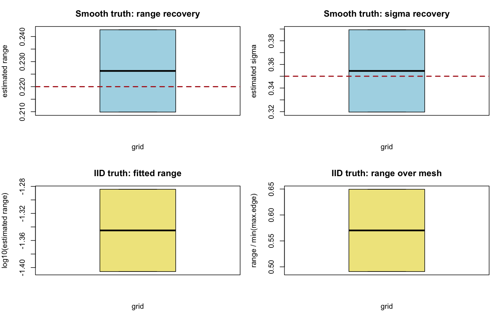

# 2D Matern vs IID Comparison

## Configuration

- reps per cell: 2
- true Matern range: 0.22
- true Matern sigma: 0.35
- true intercept: 0.2
- iid tau0: 0.35
- noise sd: 0.15
- max.edge: 0.08, 0.12

## Selection Summary

setting | grid_label | n | n_valid | p_matern | p_iid | mean_delta | median_delta
--- | --- | --- | --- | --- | --- | --- | ---
iid_truth | 12x10 | 120.0000 | 2.0000 | 0.0000 | 1.0000 | -0.3813 | -0.3813
smooth_truth | 12x10 | 120.0000 | 2.0000 | 1.0000 | 0.0000 | 14.2887 | 14.2887

## Smooth Truth

grid_label | n | mean_est_range | median_est_range | mean_est_sigma | median_est_sigma | mean_abs_err_range | mean_abs_err_sigma | mean_surface_corr
--- | --- | --- | --- | --- | --- | --- | --- | ---
12x10 | 120.0000 | 0.2263 | 0.2263 | 0.3545 | 0.3545 | 0.0164 | 0.0349 | 0.9265

## IID Truth

grid_label | n | mean_est_range | q10_est_range | q50_est_range | q90_est_range | q10_range_over_mesh | q50_range_over_mesh | q90_range_over_mesh | mean_surface_corr
--- | --- | --- | --- | --- | --- | --- | --- | --- | ---
12x10 | 120.0000 | 0.0456 | 0.0405 | 0.0456 | 0.0507 | 0.5067 | 0.5702 | 0.6337 | 0.9393

## Figures

