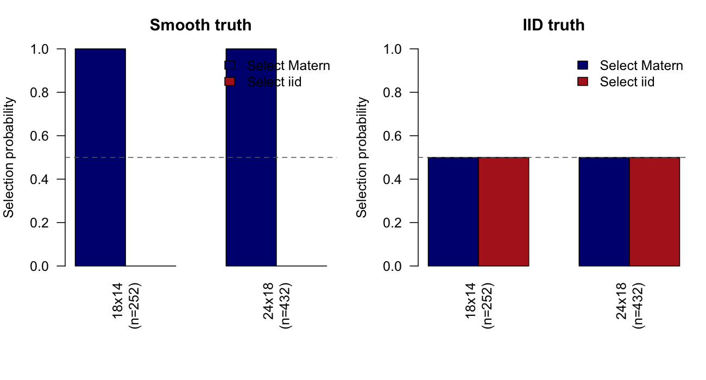
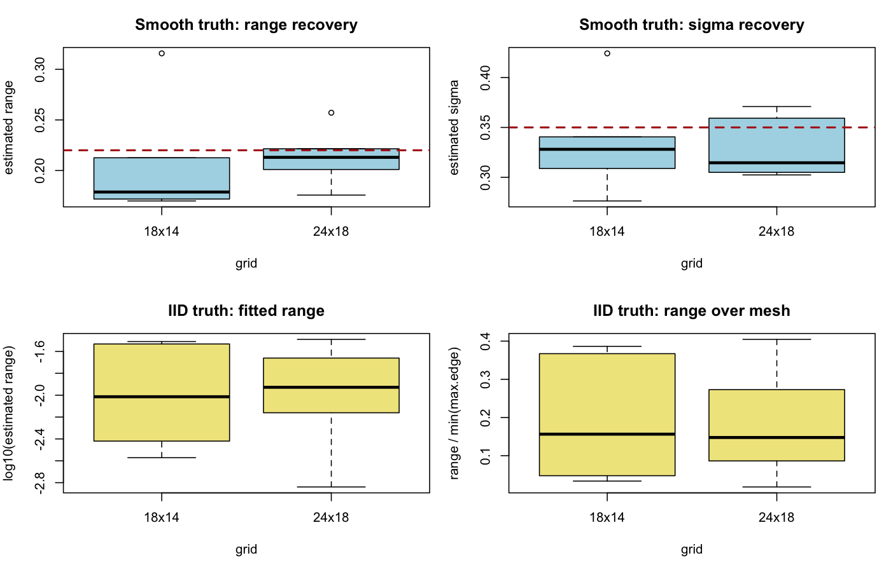

# 2D Matern vs IID Comparison

## Configuration

- reps per cell: 6
- true Matern range: 0.22
- true Matern sigma: 0.35
- true intercept: 0.2
- iid tau0: 0.35
- noise sd: 0.15
- max.edge: 0.08, 0.12

## Selection Summary

setting | grid_label | n | n_valid | p_matern | p_iid | mean_delta | median_delta
--- | --- | --- | --- | --- | --- | --- | ---
iid_truth | 18x14 | 252.0000 | 6.0000 | 0.5000 | 0.5000 | 0.0223 | 0.1154
iid_truth | 24x18 | 432.0000 | 6.0000 | 0.5000 | 0.5000 | -0.2014 | -0.4915
smooth_truth | 18x14 | 252.0000 | 6.0000 | 1.0000 | 0.0000 | 48.9489 | 41.9393
smooth_truth | 24x18 | 432.0000 | 6.0000 | 1.0000 | 0.0000 | 142.2911 | 134.3418

## Smooth Truth

grid_label | n | mean_est_range | median_est_range | mean_est_sigma | median_est_sigma | mean_abs_err_range | mean_abs_err_sigma | mean_surface_corr
--- | --- | --- | --- | --- | --- | --- | --- | ---
18x14 | 252.0000 | 0.2046 | 0.1788 | 0.3343 | 0.3281 | 0.0473 | 0.0404 | 0.9327
24x18 | 432.0000 | 0.2136 | 0.2130 | 0.3278 | 0.3146 | 0.0193 | 0.0323 | 0.9419

## IID Truth

grid_label | n | mean_est_range | q10_est_range | q50_est_range | q90_est_range | q10_range_over_mesh | q50_range_over_mesh | q90_range_over_mesh | mean_surface_corr
--- | --- | --- | --- | --- | --- | --- | --- | --- | ---
18x14 | 252.0000 | 0.0153 | 0.0032 | 0.0125 | 0.0301 | 0.0406 | 0.1564 | 0.3766 | 0.9242
24x18 | 432.0000 | 0.0144 | 0.0042 | 0.0118 | 0.0271 | 0.0522 | 0.1476 | 0.3387 | 0.9182

## Figures

