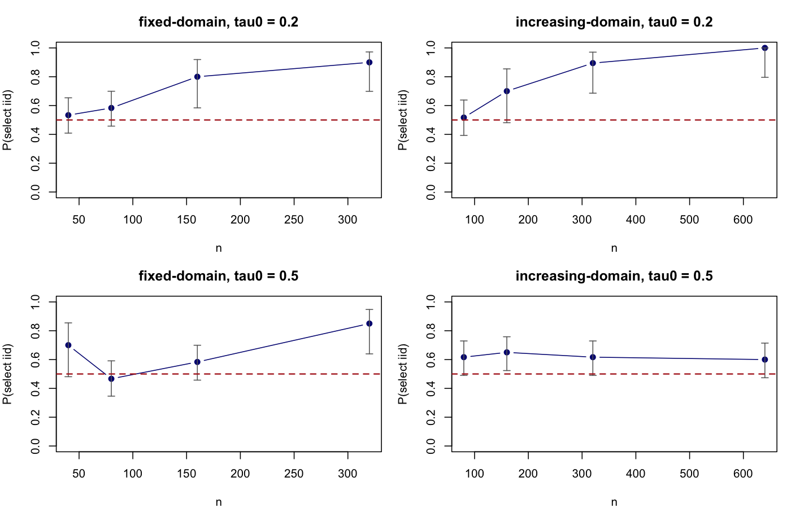
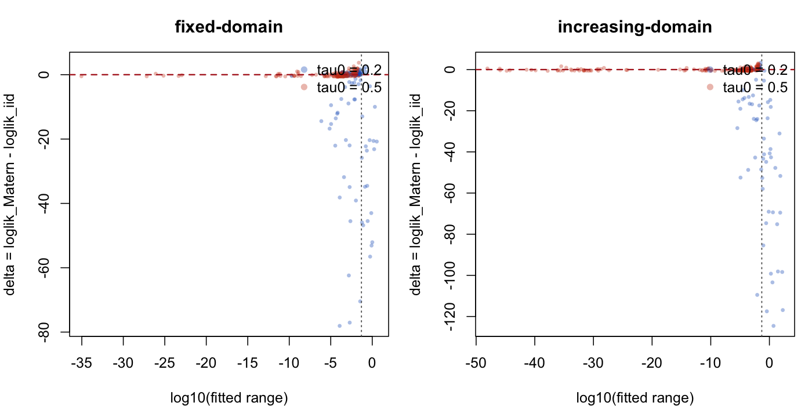

# IID vs Matern Selection Study

## Run Configuration

- mode: full
- seed base: 20260413
- pilot reps per cell: 20
- confirmatory reps target: 60
- confirmatory enabled: TRUE
- mu0: 0.3
- noise sd: 0.2
- max.edge: 0.05
- refined max.edge: 0.025
- selection tolerance: 1e-06

## Final Summary

regime | tau0 | n | n_valid | p_iid | ci_low | ci_high | p_matern | p_tie | roughly_half | median_range_over_mesh_if_matern_selected
--- | --- | --- | --- | --- | --- | --- | --- | --- | --- | ---
fixed-domain | 0.2000 | 40.0000 | 60.0000 | 0.5333 | 0.4089 | 0.6537 | 0.4667 | 0.0000 | TRUE | 0.3965
fixed-domain | 0.2000 | 80.0000 | 60.0000 | 0.5833 | 0.4573 | 0.6994 | 0.4167 | 0.0000 | TRUE | 0.1024
fixed-domain | 0.2000 | 160.0000 | 20.0000 | 0.8000 | 0.5840 | 0.9193 | 0.2000 | 0.0000 | FALSE | 0.0348
fixed-domain | 0.2000 | 320.0000 | 20.0000 | 0.9000 | 0.6990 | 0.9721 | 0.1000 | 0.0000 | FALSE | 0.0300
fixed-domain | 0.5000 | 40.0000 | 20.0000 | 0.7000 | 0.4810 | 0.8545 | 0.3000 | 0.0000 | FALSE | 0.1670
fixed-domain | 0.5000 | 80.0000 | 60.0000 | 0.4667 | 0.3463 | 0.5911 | 0.5333 | 0.0000 | TRUE | 0.1766
fixed-domain | 0.5000 | 160.0000 | 60.0000 | 0.5833 | 0.4573 | 0.6994 | 0.4167 | 0.0000 | TRUE | 0.0025
fixed-domain | 0.5000 | 320.0000 | 20.0000 | 0.8500 | 0.6396 | 0.9476 | 0.1500 | 0.0000 | FALSE | 0.0003
increasing-domain | 0.2000 | 80.0000 | 60.0000 | 0.5167 | 0.3931 | 0.6382 | 0.4833 | 0.0000 | TRUE | 0.2548
increasing-domain | 0.2000 | 160.0000 | 20.0000 | 0.7000 | 0.4810 | 0.8545 | 0.3000 | 0.0000 | FALSE | 0.1946
increasing-domain | 0.2000 | 320.0000 | 19.0000 | 0.8947 | 0.6861 | 0.9706 | 0.1053 | 0.0000 | FALSE | 0.1399
increasing-domain | 0.2000 | 640.0000 | 15.0000 | 1.0000 | 0.7961 | 1.0000 | 0.0000 | 0.0000 | FALSE | NA
increasing-domain | 0.5000 | 80.0000 | 60.0000 | 0.6167 | 0.4902 | 0.7291 | 0.3833 | 0.0000 | FALSE | 0.0121
increasing-domain | 0.5000 | 160.0000 | 60.0000 | 0.6500 | 0.5236 | 0.7583 | 0.3500 | 0.0000 | FALSE | 0.0040
increasing-domain | 0.5000 | 320.0000 | 60.0000 | 0.6167 | 0.4902 | 0.7291 | 0.3833 | 0.0000 | FALSE | 0.0008
increasing-domain | 0.5000 | 640.0000 | 60.0000 | 0.6000 | 0.4737 | 0.7143 | 0.4000 | 0.0000 | TRUE | 0.0039

## Pilot Summary

regime | tau0 | n | pilot_p_iid | pilot_ci_low | pilot_ci_high
--- | --- | --- | --- | --- | ---
fixed-domain | 0.2000 | 40.0000 | 0.6000 | 0.3866 | 0.7812
fixed-domain | 0.2000 | 80.0000 | 0.5500 | 0.3421 | 0.7418
fixed-domain | 0.2000 | 160.0000 | 0.8000 | 0.5840 | 0.9193
fixed-domain | 0.2000 | 320.0000 | 0.9000 | 0.6990 | 0.9721
fixed-domain | 0.5000 | 40.0000 | 0.7000 | 0.4810 | 0.8545
fixed-domain | 0.5000 | 80.0000 | 0.4000 | 0.2188 | 0.6134
fixed-domain | 0.5000 | 160.0000 | 0.5000 | 0.2993 | 0.7007
fixed-domain | 0.5000 | 320.0000 | 0.8500 | 0.6396 | 0.9476
increasing-domain | 0.2000 | 80.0000 | 0.5500 | 0.3421 | 0.7418
increasing-domain | 0.2000 | 160.0000 | 0.7000 | 0.4810 | 0.8545
increasing-domain | 0.2000 | 320.0000 | 0.8947 | 0.6861 | 0.9706
increasing-domain | 0.2000 | 640.0000 | 1.0000 | 0.7961 | 1.0000
increasing-domain | 0.5000 | 80.0000 | 0.5500 | 0.3421 | 0.7418
increasing-domain | 0.5000 | 160.0000 | 0.6500 | 0.4329 | 0.8188
increasing-domain | 0.5000 | 320.0000 | 0.6000 | 0.3866 | 0.7812
increasing-domain | 0.5000 | 640.0000 | 0.5000 | 0.2993 | 0.7007

## Confirmatory Cells

- fixed_domain__tau0_0.5__n_80
- fixed_domain__tau0_0.2__n_40
- fixed_domain__tau0_0.2__n_80
- fixed_domain__tau0_0.5__n_160
- increasing_domain__tau0_0.2__n_80
- increasing_domain__tau0_0.5__n_80
- increasing_domain__tau0_0.5__n_160
- increasing_domain__tau0_0.5__n_320
- increasing_domain__tau0_0.5__n_640

## Mesh Sensitivity

regime | tau0 | n | n_valid | p_flip_to_iid | median_range_ratio_refined | median_delta_change
--- | --- | --- | --- | --- | --- | ---
fixed-domain | 0.2000 | 40.0000 | 10.0000 | 0.0000 | 1.0000 | 0.0000
fixed-domain | 0.2000 | 80.0000 | 10.0000 | 0.0000 | 1.0000 | 0.0000
fixed-domain | 0.2000 | 160.0000 | 4.0000 | 0.0000 | 1.0000 | 0.0000
fixed-domain | 0.2000 | 320.0000 | 2.0000 | 0.0000 | 1.0000 | 0.0000
fixed-domain | 0.5000 | 40.0000 | 6.0000 | 0.0000 | 1.0000 | 0.0000
fixed-domain | 0.5000 | 80.0000 | 10.0000 | 0.0000 | 1.0000 | 0.0000
fixed-domain | 0.5000 | 160.0000 | 10.0000 | 0.0000 | 1.0000 | 0.0000
fixed-domain | 0.5000 | 320.0000 | 3.0000 | 0.0000 | 1.0000 | 0.0000
increasing-domain | 0.2000 | 80.0000 | 10.0000 | 0.0000 | 1.0000 | 0.0000
increasing-domain | 0.2000 | 160.0000 | 6.0000 | 0.0000 | 1.0000 | 0.0000
increasing-domain | 0.2000 | 320.0000 | 2.0000 | 0.0000 | 1.0000 | 0.0000
increasing-domain | 0.5000 | 80.0000 | 10.0000 | 0.0000 | 1.0000 | 0.0000
increasing-domain | 0.5000 | 160.0000 | 10.0000 | 0.0000 | 1.0000 | 0.0000
increasing-domain | 0.5000 | 320.0000 | 10.0000 | 0.0000 | 1.0000 | 0.0000
increasing-domain | 0.5000 | 640.0000 | 10.0000 | 0.0000 | 1.0000 | 0.0000

## Figures

