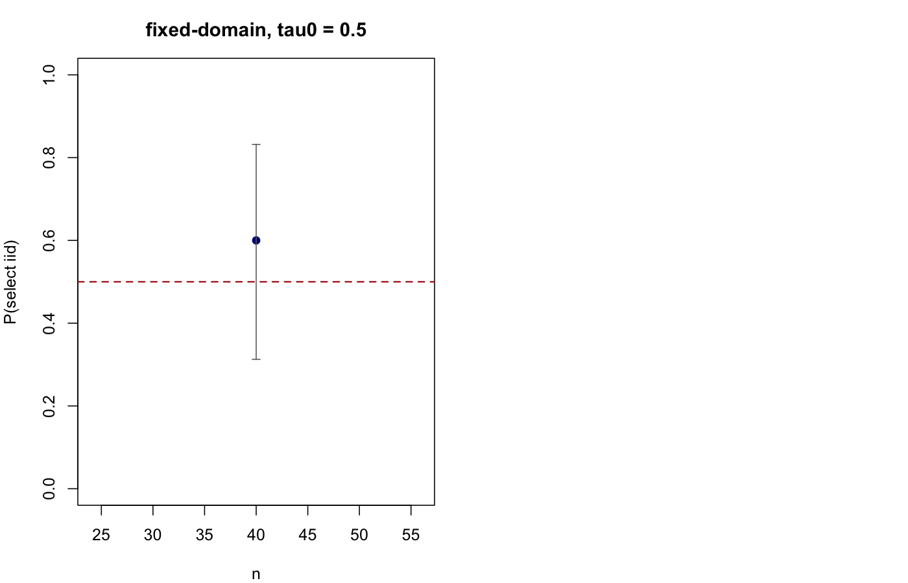
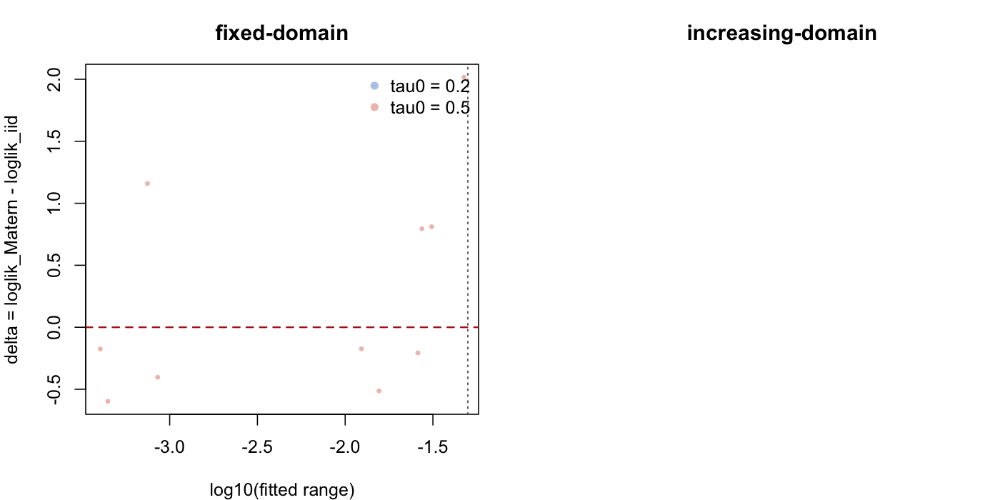

# IID vs Matern Selection Study

## Run Configuration

- mode: smoke
- seed base: 20260413
- pilot reps per cell: 10
- confirmatory reps target: 10
- confirmatory enabled: FALSE
- mu0: 0.3
- noise sd: 0.2
- max.edge: 0.05
- refined max.edge: 0.025
- selection tolerance: 1e-06

## Final Summary

regime | tau0 | n | n_valid | p_iid | ci_low | ci_high | p_matern | p_tie | roughly_half | median_range_over_mesh_if_matern_selected
--- | --- | --- | --- | --- | --- | --- | --- | --- | --- | ---
fixed-domain | 0.5000 | 40.0000 | 10.0000 | 0.6000 | 0.3127 | 0.8318 | 0.4000 | 0.0000 | TRUE | 0.5848

## Mesh Sensitivity

regime | tau0 | n | n_valid | p_flip_to_iid | median_range_ratio_refined | median_delta_change
--- | --- | --- | --- | --- | --- | ---
fixed-domain | 0.5000 | 40.0000 | 4.0000 | 0.0000 | 1.0000 | 0.0000

## Figures

