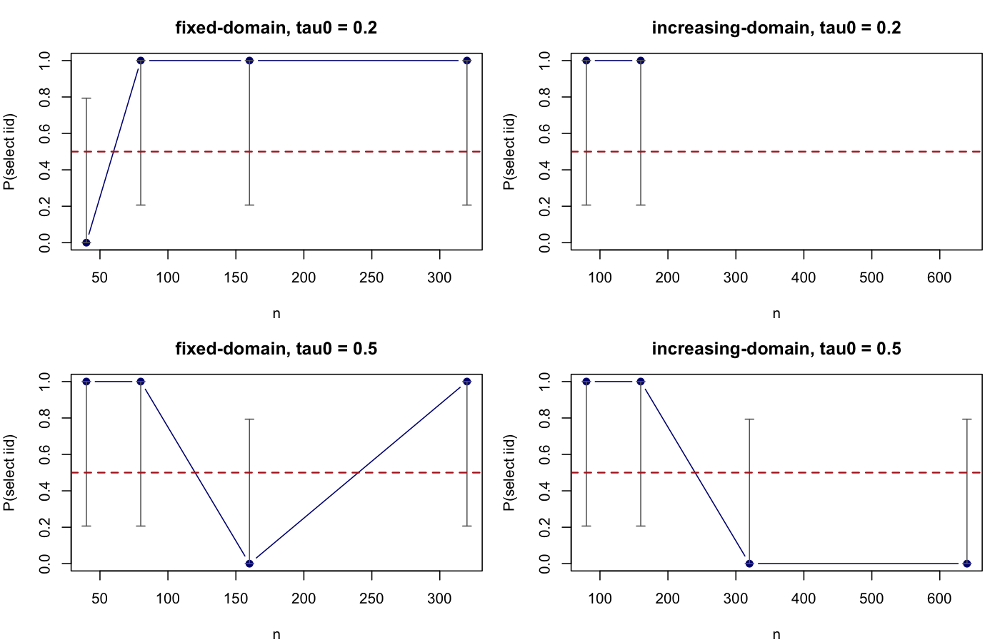
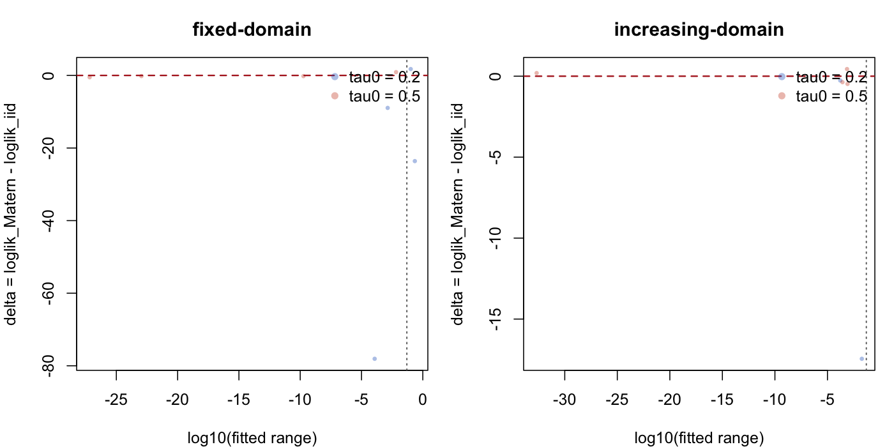

# IID vs Matern Selection Study

## Run Configuration

- mode: full
- seed base: 20260413
- pilot reps per cell: 1
- confirmatory reps target: 1
- confirmatory enabled: FALSE
- mu0: 0.3
- noise sd: 0.2
- max.edge: 0.05
- refined max.edge: 0.025
- selection tolerance: 1e-06

## Final Summary

regime | tau0 | n | n_valid | p_iid | ci_low | ci_high | p_matern | p_tie | roughly_half | median_range_over_mesh_if_matern_selected
--- | --- | --- | --- | --- | --- | --- | --- | --- | --- | ---
fixed-domain | 0.2000 | 40.0000 | 1.0000 | 0.0000 | 0.0000 | 0.7935 | 1.0000 | 0.0000 | FALSE | 2.0665
fixed-domain | 0.2000 | 80.0000 | 1.0000 | 1.0000 | 0.2065 | 1.0000 | 0.0000 | 0.0000 | FALSE | NA
fixed-domain | 0.2000 | 160.0000 | 1.0000 | 1.0000 | 0.2065 | 1.0000 | 0.0000 | 0.0000 | FALSE | NA
fixed-domain | 0.2000 | 320.0000 | 1.0000 | 1.0000 | 0.2065 | 1.0000 | 0.0000 | 0.0000 | FALSE | NA
fixed-domain | 0.5000 | 40.0000 | 1.0000 | 1.0000 | 0.2065 | 1.0000 | 0.0000 | 0.0000 | FALSE | NA
fixed-domain | 0.5000 | 80.0000 | 1.0000 | 1.0000 | 0.2065 | 1.0000 | 0.0000 | 0.0000 | FALSE | NA
fixed-domain | 0.5000 | 160.0000 | 1.0000 | 0.0000 | 0.0000 | 0.7935 | 1.0000 | 0.0000 | FALSE | 0.1318
fixed-domain | 0.5000 | 320.0000 | 1.0000 | 1.0000 | 0.2065 | 1.0000 | 0.0000 | 0.0000 | FALSE | NA
increasing-domain | 0.2000 | 80.0000 | 1.0000 | 1.0000 | 0.2065 | 1.0000 | 0.0000 | 0.0000 | FALSE | NA
increasing-domain | 0.2000 | 160.0000 | 1.0000 | 1.0000 | 0.2065 | 1.0000 | 0.0000 | 0.0000 | FALSE | NA
increasing-domain | 0.2000 | 320.0000 | 0.0000 | NA | NA | NA | NA | NA | FALSE | NA
increasing-domain | 0.2000 | 640.0000 | 0.0000 | NA | NA | NA | NA | NA | FALSE | NA
increasing-domain | 0.5000 | 80.0000 | 1.0000 | 1.0000 | 0.2065 | 1.0000 | 0.0000 | 0.0000 | FALSE | NA
increasing-domain | 0.5000 | 160.0000 | 1.0000 | 1.0000 | 0.2065 | 1.0000 | 0.0000 | 0.0000 | FALSE | NA
increasing-domain | 0.5000 | 320.0000 | 1.0000 | 0.0000 | 0.0000 | 0.7935 | 1.0000 | 0.0000 | FALSE | 0.0146
increasing-domain | 0.5000 | 640.0000 | 1.0000 | 0.0000 | 0.0000 | 0.7935 | 1.0000 | 0.0000 | FALSE | 0.0000

## Pilot Summary

regime | tau0 | n | pilot_p_iid | pilot_ci_low | pilot_ci_high
--- | --- | --- | --- | --- | ---
fixed-domain | 0.2000 | 40.0000 | 0.0000 | 0.0000 | 0.7935
fixed-domain | 0.2000 | 80.0000 | 1.0000 | 0.2065 | 1.0000
fixed-domain | 0.2000 | 160.0000 | 1.0000 | 0.2065 | 1.0000
fixed-domain | 0.2000 | 320.0000 | 1.0000 | 0.2065 | 1.0000
fixed-domain | 0.5000 | 40.0000 | 1.0000 | 0.2065 | 1.0000
fixed-domain | 0.5000 | 80.0000 | 1.0000 | 0.2065 | 1.0000
fixed-domain | 0.5000 | 160.0000 | 0.0000 | 0.0000 | 0.7935
fixed-domain | 0.5000 | 320.0000 | 1.0000 | 0.2065 | 1.0000
increasing-domain | 0.2000 | 80.0000 | 1.0000 | 0.2065 | 1.0000
increasing-domain | 0.2000 | 160.0000 | 1.0000 | 0.2065 | 1.0000
increasing-domain | 0.2000 | 320.0000 | NA | NA | NA
increasing-domain | 0.2000 | 640.0000 | NA | NA | NA
increasing-domain | 0.5000 | 80.0000 | 1.0000 | 0.2065 | 1.0000
increasing-domain | 0.5000 | 160.0000 | 1.0000 | 0.2065 | 1.0000
increasing-domain | 0.5000 | 320.0000 | 0.0000 | 0.0000 | 0.7935
increasing-domain | 0.5000 | 640.0000 | 0.0000 | 0.0000 | 0.7935

## Figures

