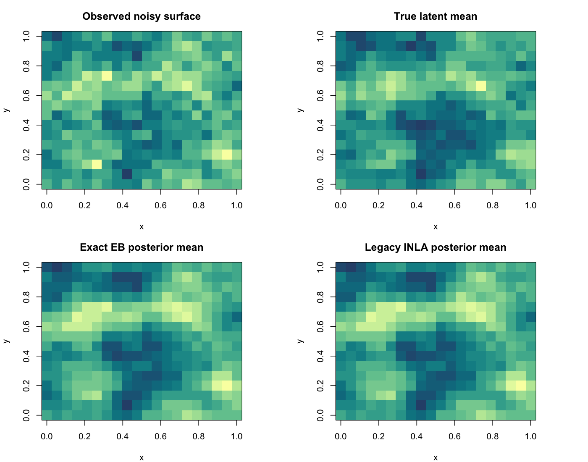

# Exact Matern vs Legacy INLA PC-Prior Sanity Check

Generated on 2026-04-12 15:43:59 CDT

## Setup

- Single 2D simulation on a 20 x 16 grid (n = 320).
- Truth: range = 0.30, sigma = 0.35, beta0 = 0.2, noise sd = 0.22, alpha = 2.
- Exact method: current package implementation with exact Gaussian marginal likelihood.
- Legacy method: an INLA route using `inla.spde2.pcmatern()` and INLA's internal EB optimization with joint PC priors on both range and sigma.

## Important Caveat

- The exact method optimizes an unpenalized exact Gaussian marginal likelihood, while the legacy INLA route uses a penalized objective induced by the PC priors and INLA's internal approximation machinery.
- Because of that objective mismatch, the legacy `mlik` reported by INLA is still not directly comparable to the exact method's raw marginal log-likelihood, even though both methods now fit range and sigma.

## Hyperparameters

method | fitted_range | fitted_sigma | fitted_beta
--- | --- | --- | ---
Exact EB | 0.2914 | 0.3527 | 0.1959
Legacy INLA + Joint PC prior | 0.3035 | 0.3630 | 0.1958

## Runtime

method | elapsed_sec
--- | ---
Exact EB | 14.3890
Legacy INLA + Joint PC prior | 4.8570

## Posterior Surface Comparison

metric | value
--- | ---
corr_exact_vs_legacy | 0.999996
rmse_exact_vs_legacy | 0.001070
rmse_exact_vs_truth | 0.149820
rmse_legacy_vs_truth | 0.149895
corr_exact_vs_truth | 0.906784
corr_legacy_vs_truth | 0.906751

Figure:

## Objective Comparison

quantity | value
--- | ---
Exact log marginal likelihood at exact optimum | -89.024405
Exact log marginal likelihood at legacy fitted range/sigma (beta profiled) | -89.052058
Gap: exact optimum minus profiled legacy-hyperparameter objective | 0.027654
Legacy INLA raw mlik (not directly comparable) | -89.052058

Interpretation:

- The posterior correlation between the two fitted surfaces is 0.999996.
- The exact objective gap between the exact optimum and the best exact-model fit constrained to the legacy fitted range/sigma pair is 0.027654.
- This exact-objective gap is the more meaningful same-scale comparison, because the raw INLA `mlik` includes a different model/objective configuration.
