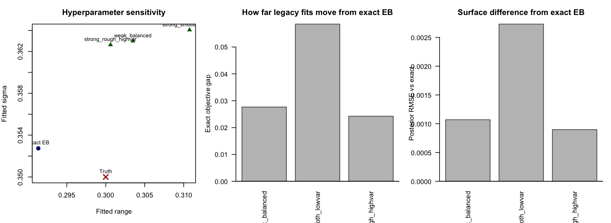

# Matern PC Prior Sensitivity Check

Generated on 2026-04-12 15:48:33 CDT

## Setup

- Fixed single 2D dataset on a 20 x 16 grid (n = 320).
- Truth: range = 0.30, sigma = 0.35, beta0 = 0.20, noise sd = 0.22, alpha = 2.
- Exact baseline: current exact Gaussian EB Matern implementation.
- Legacy variants: INLA + joint PC priors on both range and sigma.

## Prior Scenario Interpretation

- For the range prior, INLA uses `P(range < rho0) = alpha_r`.
- For the sigma prior, INLA uses `P(sigma > sigma0) = alpha_sigma`.
- Small `(alpha_r, alpha_sigma)` pushes toward smoother, lower-variance fields.
- Large `(alpha_r, alpha_sigma)` pushes toward rougher, higher-variance fields.

## Exact Baseline

method | fitted_range | fitted_sigma | fitted_beta | runtime_sec | exact_loglik | posterior_corr_vs_truth | posterior_rmse_vs_truth
--- | --- | --- | --- | --- | --- | --- | ---
Exact EB | 0.291351 | 0.352736 | 0.195882 | 14.452000 | -89.024405 | 0.906784 | 0.149820

## Legacy INLA Scenarios

scenario | range_prob | sigma_prob | fitted_range | fitted_sigma | fitted_beta | runtime_sec | raw_mlik | exact_loglik_at_legacy | exact_gap_to_optimum | posterior_corr_vs_exact | posterior_rmse_vs_exact | posterior_corr_vs_truth | posterior_rmse_vs_truth
--- | --- | --- | --- | --- | --- | --- | --- | --- | --- | --- | --- | --- | ---
weak_balanced | 0.500000 | 0.500000 | 0.303481 | 0.362997 | 0.195837 | 5.443000 | -89.052058 | -89.052058 | 0.027653 | 0.999996 | 0.001070 | 0.906751 | 0.149895
strong_smooth_lowvar | 0.100000 | 0.100000 | 0.310747 | 0.364053 | 0.195600 | 4.627000 | -89.082946 | -89.082946 | 0.058541 | 0.999967 | 0.002732 | 0.906806 | 0.149786
strong_rough_highvar | 0.900000 | 0.900000 | 0.300609 | 0.362631 | 0.195931 | 4.666000 | -89.048650 | -89.048650 | 0.024245 | 0.999999 | 0.000898 | 0.906722 | 0.149947

Figure:

## Interpretation

- The weakest balanced prior (`0.5`, `0.5`) gives fitted `(range, sigma) = (0.3035, 0.3630)`.
- The smooth/low-variance prior and the rough/high-variance prior move the legacy fit by exact-objective gaps of 0.0585 and 0.0242, respectively.
- If these gaps and posterior RMSE values stay small, then the exact EB fit and the legacy INLA fit are practically hard to distinguish on this dataset.
- If they become large under strong priors, that is direct evidence that the prior is driving the legacy fit away from the exact EB objective.
