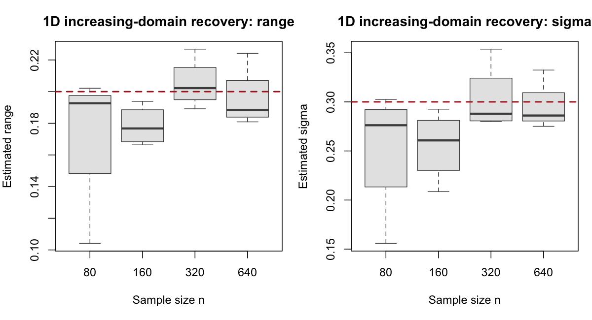
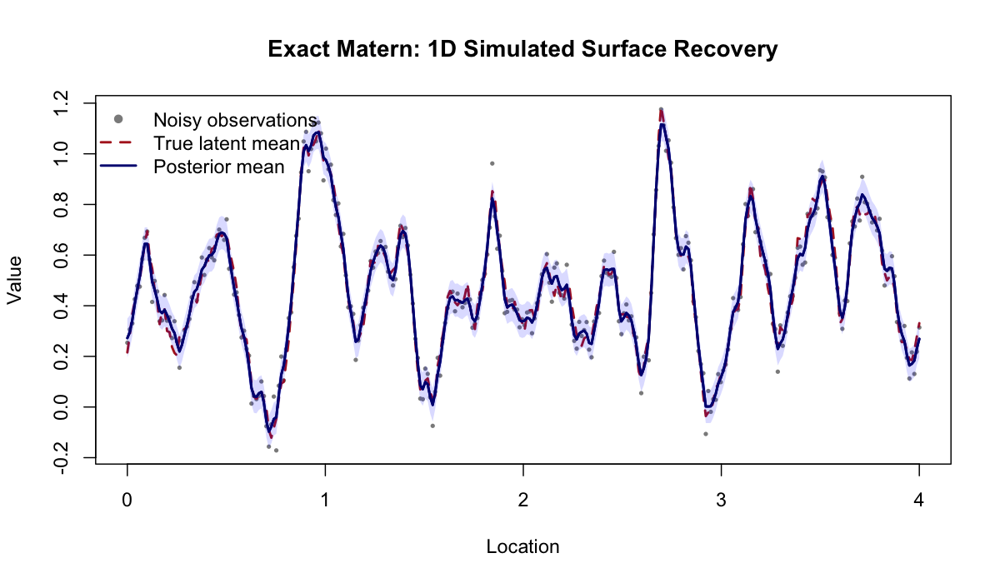
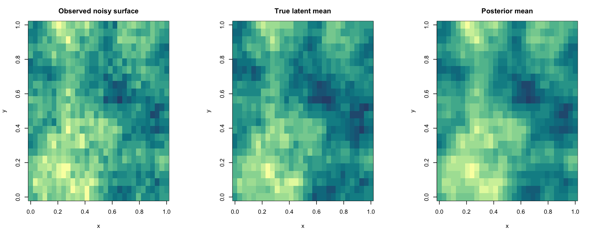
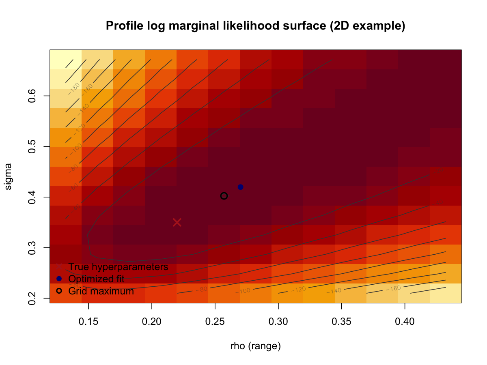

# Exact Matern Validation

Generated on 2026-04-12 15:04:30 CDT

## Validation Questions

1. Do the empirical-Bayes smoothing hyperparameters recover the truth in a well-specified simulation?
2. Does the fitted posterior surface track the true simulated surface well?
3. Does the exact marginal likelihood agree with a dense Gaussian calculation?

## Simulation Setup

- Hyperparameter-recovery experiment: 1D exact-data simulation with true range = 0.2, true sigma = 0.3, true beta0 = 0.4, noise sd = 0.05, alpha = 2.
- 1D design uses an increasing-domain regime: the sampling density is held roughly fixed at 80 points per unit length, so the domain length is n / 80.
- Sample sizes checked: 80, 160, 320, 640.
- Replicates per sample size: 4.
- Additional 2D recovery experiment: true range = 0.22, true sigma = 0.35, true beta0 = 0.2, noise sd = 0.15, alpha = 2.
- 2D grid sizes checked: 30x24 (n=720), 36x28 (n=1008).
- Replicates per 2D grid size: 2.

## Parameter-Recovery Summary (1D)

n | domain_length | mean_est_range | sd_est_range | median_est_range | mean_est_sigma | sd_est_sigma | median_est_sigma | mean_abs_err_range | mean_abs_err_sigma | mean_surface_rmse | mean_surface_corr
--- | --- | --- | --- | --- | --- | --- | --- | --- | --- | --- | ---
80.0000 | 1.0000 | 0.1729 | 0.0460 | 0.1926 | 0.2527 | 0.0659 | 0.2762 | 0.0282 | 0.0486 | 0.0326 | 0.9898
160.0000 | 2.0000 | 0.1784 | 0.0126 | 0.1767 | 0.2557 | 0.0356 | 0.2608 | 0.0216 | 0.0443 | 0.0332 | 0.9918
320.0000 | 4.0000 | 0.2051 | 0.0158 | 0.2022 | 0.3024 | 0.0348 | 0.2879 | 0.0105 | 0.0245 | 0.0306 | 0.9949
640.0000 | 8.0000 | 0.1954 | 0.0195 | 0.1884 | 0.2949 | 0.0255 | 0.2861 | 0.0166 | 0.0213 | 0.0322 | 0.9941

Interpretation:

Figure:

- Mean surface RMSE drops from 0.0326 to 0.0322, while mean correlation rises from 0.9898 to 0.9941.
- The range and sigma boxplots are the main convergence diagnostic here: with increasing domain, they should tighten around the truth if the EB objective is behaving sensibly.

These results show that surface recovery improves strongly with sample size in the exact-model setting, but they are not a formal proof of asymptotic consistency.

## Parameter-Recovery Summary (2D)

nx | ny | n | mean_est_range | sd_est_range | mean_est_sigma | sd_est_sigma | mean_abs_err_range | mean_abs_err_sigma | mean_surface_rmse | mean_surface_corr
--- | --- | --- | --- | --- | --- | --- | --- | --- | --- | ---
30.0000 | 24.0000 | 720.0000 | 0.2422 | 0.0141 | 0.3613 | 0.0289 | 0.0222 | 0.0204 | 0.1108 | 0.9523
36.0000 | 28.0000 | 1008.0000 | 0.2164 | 0.0128 | 0.3545 | 0.0282 | 0.0091 | 0.0199 | 0.0994 | 0.9612

- At the larger 2D grid size (n = 1008), the mean fitted range is 0.2164 versus truth 0.2200, and the mean fitted sigma is 0.3545 versus truth 0.3500.
- Mean 2D surface correlation is 0.9523 at n = 720 and 0.9612 at n = 1008.
- The larger 2D noise level makes the observed surface materially rougher than the latent truth, so the posterior mean comparison is now more informative than in the earlier low-noise example.

## Surface-Recovery Examples

### 1D Example Metrics

surface_rmse | surface_corr | est_range | est_sigma | est_beta
--- | --- | --- | --- | ---
0.0309 | 0.9926 | 0.1799 | 0.2626 | 0.4718

Figure:

### 2D Example Metrics

n | surface_rmse | surface_corr | est_range | est_sigma | est_beta | true_range | true_sigma | true_beta
--- | --- | --- | --- | --- | --- | --- | --- | ---
720.0000 | 0.1078 | 0.9731 | 0.2701 | 0.4198 | 0.2191 | 0.2200 | 0.3500 | 0.2000

Figure:

## Profile Marginal-Likelihood Surface (2D Example)

true_range | true_sigma | fitted_range | fitted_sigma | grid_max_range | grid_max_sigma | profiled_beta_at_true | profiled_beta_at_fit | profiled_beta_at_grid_max | loglik_at_true | loglik_at_fit | loglik_at_grid_max | gap_true_to_grid_max | gap_fit_to_grid_max
--- | --- | --- | --- | --- | --- | --- | --- | --- | --- | --- | --- | --- | ---
0.220000 | 0.350000 | 0.270113 | 0.419786 | 0.257075 | 0.402357 | 0.222260 | 0.219046 | 0.219869 | -41.486863 | -39.345130 | -39.436797 | 2.050066 | -0.091667

Figure:

Interpretation:

- The fitted point is at (rho, sigma) = (0.2701, 0.4198), while the true point is (0.2200, 0.3500).
- The profile log-likelihood gap from the true point to the grid maximum is 2.0501.
- The fitted point is slightly above the coarse grid maximum by 0.091667 log-likelihood units, which is expected because the optimizer is continuous while the plotted surface is evaluated on a finite grid.

## Marginal-Likelihood Check

param_id | range | sigma | beta0 | exact_loglik | dense_loglik | abs_diff
--- | --- | --- | --- | --- | --- | ---
1.00000000 | 0.20000000 | 0.40000000 | 0.00000000 | -37.94774676 | -37.94774676 | 0.00000000
2.00000000 | 0.30000000 | 0.70000000 | 0.50000000 | -29.94955707 | -29.94955707 | 0.00000000
3.00000000 | 0.12000000 | 0.25000000 | -0.20000000 | -59.05153759 | -59.05153759 | 0.00000000
4.00000000 | 0.18000000 | 0.55000000 | 0.30000000 | -26.54344204 | -26.54344204 | 0.00000000
5.00000000 | 0.26000000 | 0.35000000 | -0.10000000 | -54.43204647 | -54.43204647 | 0.00000000

Maximum absolute difference between the package's exact marginal likelihood and the dense Gaussian calculation: 5.68434e-14.

This numerical agreement is the strongest direct check that the current exact marginal-likelihood implementation is algebraically correct for the tested cases.

## Notes

- During this validation pass, a log-determinant bug in `.compute_logdet_spd()` was found and fixed before finalizing the results.
- The hyperparameter-recovery experiment is intentionally based on data simulated from the package's own exact Matern latent-field model, so it checks internal statistical and numerical coherence rather than external model robustness.
