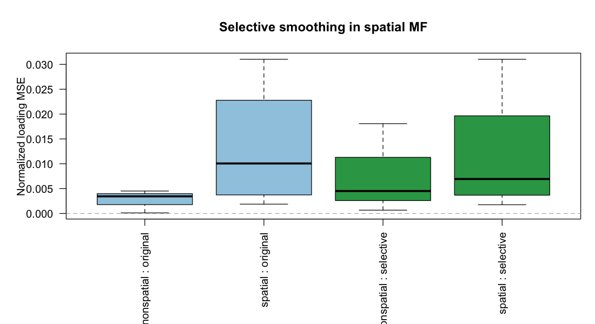

# Spatial Matrix-Factorization Selective Smoothing Study

- replicates: 2
- grid side: 8
- features (p): 24
- spatial components: 2
- nonspatial components: 2
- observation noise SD: 0.5
- screening tolerance: 1e-06

## Run Summary

rep | status | n_estimated_components | n_screened_spatial | label_accuracy | original_spatial_loading_mse | selective_spatial_loading_mse | original_nonspatial_loading_mse | selective_nonspatial_loading_mse | max_abs_nonspatial_loading_change
--- | --- | --- | --- | --- | --- | --- | --- | --- | ---
1.0000 | ok | 3.0000 | 3.0000 | 0.6667 | 0.0165 | 0.0164 | 1e-04 | 0.0007 | 0.0000
2.0000 | ok | 4.0000 | 4.0000 | 0.5000 | 0.0101 | 0.0069 | 4e-03 | 0.0113 | 0.0000

## Label Accuracy

component_group | n_components | n_scored | p_correct | mean_delta
--- | --- | --- | --- | ---
spatial | 4.0000 | 4.0000 | 1.0000 | 16.2166
nonspatial | 3.0000 | 3.0000 | 0.0000 | 0.3039
overall | 7.0000 | 7.0000 | 0.5714 | 9.3969

## Recovery Summary

stage | true_component_type | n_components | mean_loading_cor | mean_factor_cor | mean_loading_mse | mean_factor_mse
--- | --- | --- | --- | --- | --- | ---
original | spatial | 4.0000 | 0.5638 | 0.4935 | 0.0133 | 107.3061
original | nonspatial | 3.0000 | 0.9141 | 0.9735 | 0.0027 | 2.9095
selective | spatial | 4.0000 | 0.6129 | 0.4647 | 0.0117 | 108.4988
selective | nonspatial | 3.0000 | 0.7630 | 0.9858 | 0.0078 | 3.1636
original | overall | 7.0000 | 0.7139 | 0.6992 | 0.0087 | 62.5647
selective | overall | 7.0000 | 0.6772 | 0.6880 | 0.0100 | 63.3551

