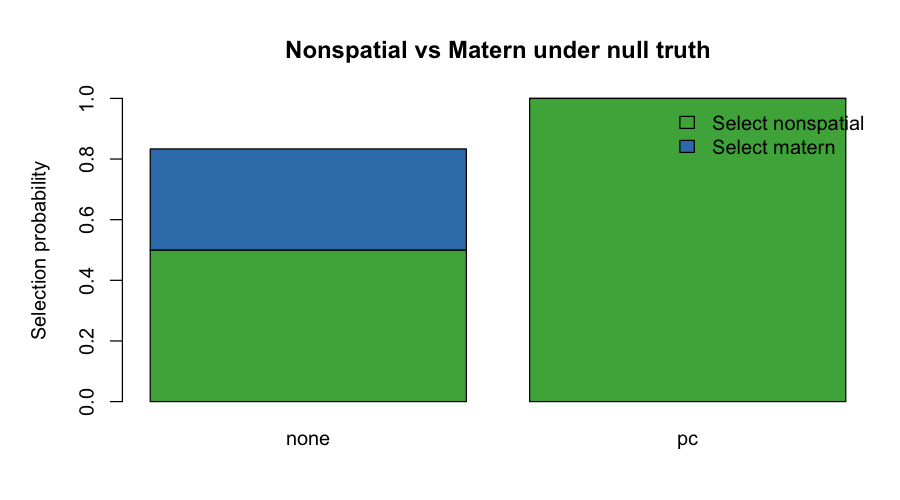

# Nonspatial vs Matern Null Study

- grid: 12 x 10
- confirmatory replicates per prior mode: 6
- chosen null noise SD from pilot: 0.2
- selection tolerance: 1e-06

## Pilot Summary

noise_sd | n_valid | p_nonspatial | distance_to_half
--- | --- | --- | ---
0.2000 | 4.0000 | 0.5000 | 0.0000
0.3000 | 4.0000 | 0.5000 | 0.0000
0.0500 | 4.0000 | 0.0000 | 0.5000
0.1000 | 4.0000 | 0.0000 | 0.5000
0.1500 | 4.0000 | 0.0000 | 0.5000

## Confirmatory Summary

prior_mode | noise_sd | n_total | n_valid | p_matern | p_nonspatial | p_tie | mean_delta | median_delta
--- | --- | --- | --- | --- | --- | --- | --- | ---
none | 0.2000 | 6.0000 | 6.0000 | 0.3333 | 0.5000 | 0.1667 | 0.5699 | 0.0000
pc | 0.2000 | 6.0000 | 6.0000 | 0.0000 | 1.0000 | 0.0000 | -7.5470 | -8.1713

